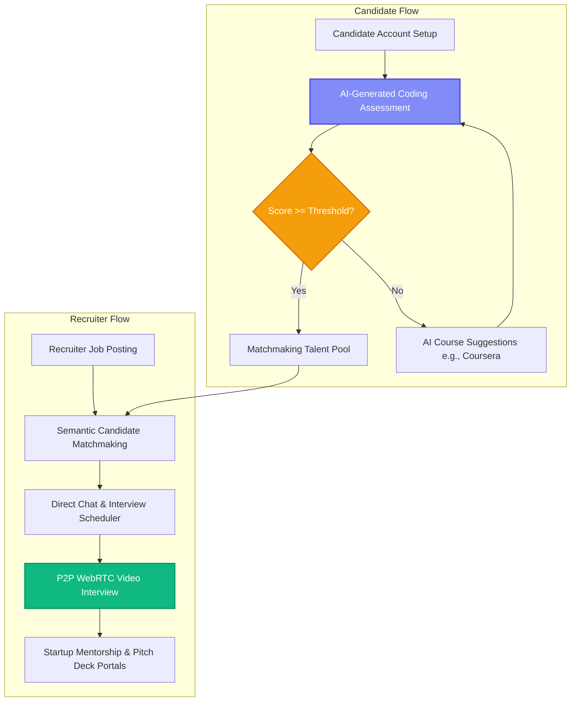
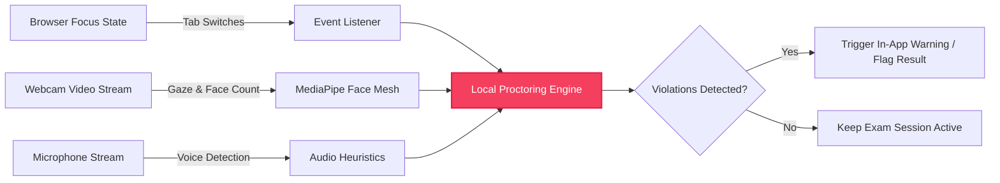
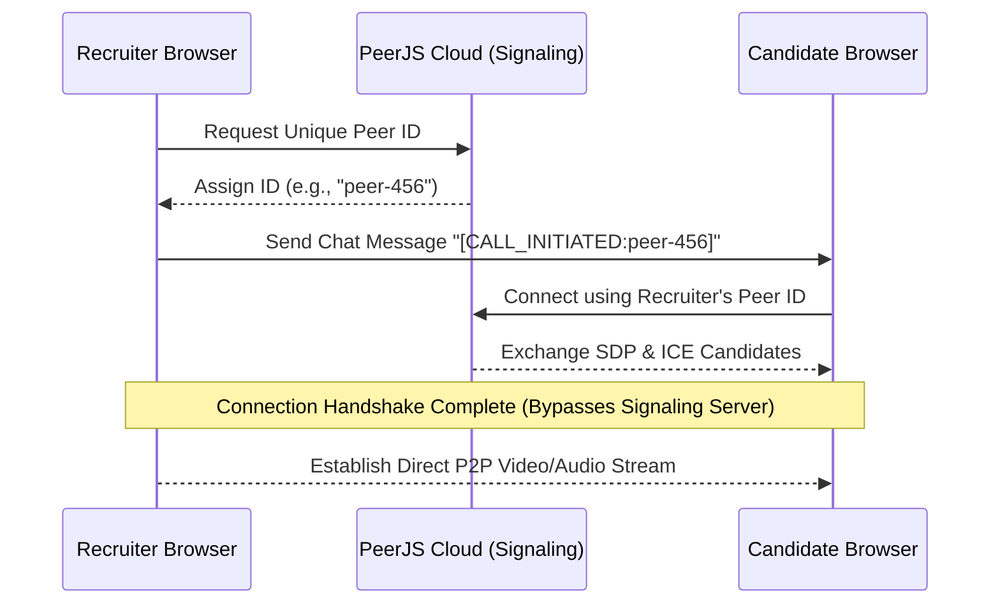

# TrueHire 🎓 | AI Recruitment & Real-Time ML Proctoring Engine

TrueHire is a full-stack job hiring platform designed to prioritize **practical skills over degrees** in recruitment.

---

## 🗺️ System Workflows & Architecture

### 1. Overall Candidate & Recruiter Journey
This diagram illustrates the skill-first evaluation flow, course recommendations for bridged skill gaps, and the recruiter hiring loop:



### 2. Client-Side Anti-Cheat Proctoring Pipeline
How facial, audio, and browser window tracking run in-browser at sub-50ms latency to enforce strict testing security:



### 3. WebRTC Video Call signaling Flow
The direct peer-to-peer connection lifecycle established between a recruiter and candidate:



---

## 🛠️ What We Have Done in This Project

1.  **AI-Generated Assessments & Grading:** Integrated Google Gemini 1.5 Flash to dynamically generate custom coding assessments (React/SQL) and automatically grade candidate submissions in under 1.5 seconds.
2.  **Personalized Learning Recommendation Engine:** Built a pipeline that analyzes candidate assessment scores and automatically recommends targeted courses (such as Coursera and open-source paths) to candidates who score below the hiring threshold.
3.  **Real-Time Anti-Cheat Proctoring:**
    *   *Face & Gaze Tracking:* Uses client-side **MediaPipe** to monitor eye gaze and detect extra faces.
    *   *Audio Detection:* Analyzes microphone frequencies for background voices.
    *   *Tab Lock:* Monitors browser events to alert recruiters if the candidate switches tabs or exits the exam window.
4.  **WebRTC Video Interviews:** Built a custom **PeerJS (WebRTC)** communication system featuring live chat, interview scheduling, and low-latency peer-to-peer video calling.
5.  **AI Coding Playground:** Implemented an interactive web-based coding editor with real-time feedback and competitive leaderboards.
6.  **Startup Mentorship & Investment Matching:** Added portals for candidates to pitch projects to startup mentors and request mock investment evaluations.

---

## 🏗️ Technical Stack

*   **Frontend:** React.js, TailwindCSS, MediaPipe Tasks Vision, PeerJS (WebRTC)
*   **Backend:** Node.js, Express.js, Prisma ORM, SQLite
*   **AI Models:** Google Gemini 1.5 Flash, Client-Side MediaPipe Face Mesh

---

## ⚙️ How to Run Locally

### 1. Backend Setup
```bash
cd truehire/backend
npm install
# Add DATABASE_URL and GEMINI_API_KEY to your .env file
npx prisma db push
npm run dev
```

### 2. Frontend Setup
```bash
# Run in root directory (TRUE-HIRE--main)
npm install
npm run dev
```

---

## 📊 Key Metrics
*   **Inference Latency:** `<50ms` client-side proctoring analysis.
*   **Manual Effort Saved:** Cuts manual recruiter screening times by **75%**.
*   **Grading Time:** `<1.5s` for automatic assessment evaluations.
